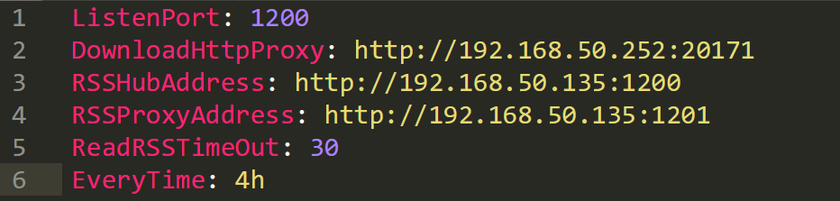

## 如何使用

下面会按本人在家部署的订阅 RSS 下载服务来举例。

目前有以下几个视频博主想要保存他们的视频进行存档：

* 巫师财经
* 李永乐
* 回形针PaperClip
* 柴知道
* 吟游诗人基德
* 讲解员河森堡
* 沙盘上的战争

每一个博主的视频希望能够按发布的时间加标题进行存储。比如：

```
Auther/2021-02-05_Title.mp4
```

除了[巫师财经](https://www.youtube.com/channel/UC55ahPQ7m5iJdVWcOfmuE6g)外，他们上传视频的网站是 B 站。那么就需要分两个方向去下载视频：

* Youtube 类型的需要代理下载，走 RSSProxy 代理
* BiliBili 无需代理下载，直接用 RSSHub 订阅

如果想快速尝鲜，那么就直接跳到 [Docker 部署](###Docker 部署)

### RSSProxy 设置

默认是添加的所有都走代理，所以如果不走代理的就不用在这设置。

RSSHub 的使用请去看对应的官网文档。

### 

建议看 [RSSProxy](https://github.com/allanpk716/RSSProxy) 的文档···后续会慢慢补···

这里主要是设置了“巫师财经”的订阅地址，后续会用到。主意这里的 Key 就是 “巫师财经”。

### RSSDownloader 设置

#### 基础配置

基本的配置信息如下图：



##### ListenPort

本程序的监听端口，如果是docker部署不要改。

##### DownloadHttpProxy

下载使用的代理服务器地址

##### RSSHubAddress

SelfHost 的 RSSHub 地址

##### RSSProxyAddress

RSSProxy 的地址

##### ReadRSSTimeOut

读取 RSS 的超时设置

##### EveryTime

下载轮询的间隔

#### RSSProxyInfos 设置

这个需要配合着  [RSSProxy 设置](###RSSProxy 设置)  的设置信息来设置。


##### DefaultDownloaderName

默认使用的下载器名称，比如 YouTube-dl，但是着其实是你下面设置的下载器来决定的哈。

##### DefaultDownloadRoot

默认的下载路径，注意，这个是你物理机器的路径，因为是要传递给 docker 下载器使用的。

##### DefaultUseProxy

是否使用代理，当然也可以在下面每个具体的 RSS key 中再次设置

##### RSSInfos

这需要配合 RSSProxy 来设置如上图

巫师财经：

* RSSInfosName：这里一定要跟 RSSProxy 中 RSSInfos 设置的 Key 一致。
* DownloadRoot：不填写这个字段，就是使用 RSSProxyInfos 的设置。这里可以再次指定这个 Key  单独的下载位置，注意一定是物理机的路径。
* UseProxy：不填写这个字段，就是使用 RSSProxyInfos 的设置。这里可以再次指定这个 Key  是否使用代理。

#### BiliBiliInfos 设置

这里直接走的是自建的 RSSHub，默认无需走代理。如果你想走代理，那么就 DefaultUseProxy: true


##### DefaultDownloaderName

默认使用的下载器名称，比如 YouTube-dl，但是着其实是你下面设置的下载器来决定的哈。

##### DefaultDownloadRoot

默认的下载路径，注意，这个是你物理机器的路径，因为是要传递给 docker 下载器使用的。

##### DefaultUseProxy

是否使用代理，当然也可以在下面每个具体的 RSS key 中再次设置

##### BiliBiliUserInfos

李永乐:

* UserID: 这个 BiliBili 对应用户的 ID
* DownloadRoot：不填写这个字段，就是使用 RSSProxyInfos 的设置。这里可以再次指定这个 Key  单独的下载位置，注意一定是物理机的路径。
* UseProxy：不填写这个字段，就是使用 RSSProxyInfos 的设置。这里可以再次指定这个 Key  是否使用代理。

#### DockerDownloaderInfos 设置

这里指定了可供选择的 Docker 下载器


默认给出了一个示例的下载器 [config.yaml.sample](https://github.com/allanpk716/RSSDownloader/blob/master/config.yaml.sample) ，使用的是 [youtube-dl docker](https://hub.docker.com/r/qmcgaw/youtube-dl-alpine/)。

这里的 Key 是 Youtube-dl，上面的设置使用默认下载器的时候用到了。

* DockSSHAddress：因为使用的是 SSH 去启动物理机的 docker 的，所以需要设置物理机的 SSH 连接

* DockerUserName：有 docker 权限的账户，且你的下载地址也得有对应的权限

* DockerPassword：密码

* UpdateCommands：连接 SSH 执行的更新用的命令，为了更新你的下载器

* DownloadCommands：下载器 docker 使用的命令

* OutSideAPPOrFolderLocation：这里可以动态的指定多个需要外部映射可执行程序或者是文件夹路径。

这里的设置用到的 $xxx$ 的变量是 RSSDownloader 使用的内置变量，不要改。

注意，这里设置 docker 的 name 为 youtube-dl-runner，是为了，如果本程序故障的时候，重复启动的时候，如果发现上一个 docker 下载器启动了没有推出就不重复启动了，不然会出问题。

**有几个特殊的内置字段需要注意下**：

##### ContainerProxy

这个与 DownloadHttpProxy 一致，会被替换，一般是为了 docker 内程序更新使用的，因为国内嘛，你懂。

##### PhysicalMachineDownloadRootPath

跟相应资源的 DefaultDownloadRoot 一致，会自动替换。

##### OutSideAPPOrFolderLocation

这个可以设置多个值，然后替换的时候是以每一个 command 中，指定对应的顺序。举例：

设置了：

```
OutSideAPPOrFolderLocation:
	- /mnt/user/appdata/rssdownloader/abc
	- /mnt/user/appdata/rssdownloader/haha
```

然后执行的命令有：

```
- docker run --rm -v $OutSideAPPOrFolderLocation0$:/downloads -v $OutSideAPPOrFolderLocation1$:/usr/local/bin/youtube-dl qmcgaw/youtube-dl-alpine
```

那么对应的：

* $OutSideAPPOrFolderLocation0$ = /mnt/user/appdata/rssdownloader/abc
* $OutSideAPPOrFolderLocation1$ = /mnt/user/appdata/rssdownloader/haha

如果执行的命令是：

```
- docker run --rm -v $OutSideAPPOrFolderLocation1$:/downloads -v $OutSideAPPOrFolderLocation0$:/usr/local/bin/youtube-dl qmcgaw/youtube-dl-alpine
```

那么其实对应的值也**一样**的，只不过在命令中换了个位置。

##### httpadd

这个是 youtube-dl 的代理设置，这个与 DownloadHttpProxy 一致，会被替换，一般是为了 docker 内程序更新使用的，因为国内嘛，你懂。

##### downloadURL

需要下载的资源的 URL，这个是 RSS 中解析出来的，无需改动。

##### nowFileName

需要将下载的资源重命名为什么名称，不包含后缀名，因为会有对应的下载程序决定。

这里默认是 **2021-02-06_VideoTitle** 这样的格式。无需修改。

注意，这里一定要用这个命名的格式，不然前面的检测是否下载过的逻辑会出问题，虽然问题不大，正常会有下载程序判断是否下载过了会跳过。

### Docker 部署

> 如果你一开始就跳到这里来看了，那么理想情况，你根据下面的提示修改基本的信息是能够直接跑起来的。如果你想知道这些设置参数有啥子用，那么建议你把上面的如何使用给看了，看不懂的话，一定是我描述的问题，不是你的问题，希望提 [ISSUS](https://github.com/allanpk716/RSSDownloader/issues) 帮后续人的能看懂（逃。

可以参考 RSSDownloader 项目中 [DockerThings](https://github.com/allanpk716/RSSDownloader/tree/master/DockerThings) 中的几个文件。

下面给出的几个文件都是以物理机 IP <u>192.168.50.135</u> 举例。

#### 1. 部署用的 [docker-compose.yaml](https://github.com/allanpk716/RSSDownloader/blob/master/DockerThings/docker-compose.yaml)

这里的 RSSHub 其实就是自行部署的 Selfhost 。如果你已经部署有了，那么就无需再整一个出来。如果不想自己部署一个，那么就用官方的 RSSHub，效果嘛，自行判断。

```yaml
version: "3"
services:
  service_rssdownloader:
    image: allanpk716/rssdownloader:latest
    container_name: rssdownloader
    ports:
      - 1202:1200
    volumes:
      - /mnt/user/appdata/rssdownloader/config.yaml:/app/config.yaml
  service_rssproxy:
    image: allanpk716/rssproxy:latest
    container_name: rssproxy
    ports:
      - 1201:1200
    volumes:
      - /mnt/user/appdata/rssproxy/config.yaml:/app/config.yaml
  service_rsshub:
    image: diygod/rsshub:latest
    container_name: rsshub
    ports:
      - 1200:1200
    environment:
      - TZ=Asia/Shanghai
```

#### 2. RSSProxy 的 [Config.yaml](https://github.com/allanpk716/RSSDownloader/blob/master/DockerThings/rssproxy-config.yaml)

```yaml
ListenPort: 1200
HttpProxy: http://192.168.50.252:20171
EveryTime: 4h

RSSInfos:
  巫师财经: https://rsshub.app/youtube/channel/UC55ahPQ7m5iJdVWcOfmuE6g
```

#### 3. RSSDownloader 的 [Config.yaml](https://github.com/allanpk716/RSSDownloader/blob/master/DockerThings/rssdownloader-config.yaml)

```yaml
ListenPort: 1200
DownloadHttpProxy: http://192.168.50.252:20171
RSSHubAddress: http://192.168.50.135:1200
RSSProxyAddress: http://192.168.50.135:1201
ReadRSSTimeOut: 30
EveryTime: 4h

# 这里订阅的RSS其实是 RSSProxy 中转的，这些 RSS 需要代理才能访问
RSSProxyInfos:
  DefaultDownloaderName: Youtube-dl
  DefaultDownloadRoot: /mnt/remotes/Video/科普
  # 使用代理下载
  DefaultUseProxy: true
  RSSInfos:
    巫师财经:
      # 相应 RSSProxy中 RSSInfos 的 key
      RSSInfosName: 巫师财经

# 这里直接走的是自建的 RSSHub，默认无需走代理
BiliBiliInfos:
  DefaultDownloaderName: Youtube-dl
  DefaultDownloadRoot: /mnt/remotes/Video/科普
  # 使用代理下载
  DefaultUseProxy: false
  BiliBiliUserInfos:
    # 这里的 Key 会直接作为下载文件夹
    李永乐:
      UserID: 9458053
    回形针PaperClip:
      UserID: 258150656
    柴知道:
      UserID: 26798384
    吟游诗人基德:
      UserID: 510856133
    讲解员河森堡:
      UserID: 483884702
    沙盘上的战争:
      UserID: 612194373

DockerDownloaderInfos:
  Youtube-dl:
    DockSSHAddress: 192.168.50.135:22
    DockerUserName: dockeruser
    DockerPassword: password
    OutSideAPPOrFolderLocation:
      - /mnt/user/appdata/rssdownloader/youtube-dl
    UpdateCommands:
      - docker pull qmcgaw/youtube-dl-alpine
      - docker run --rm --name=youtube-dl-runner -e LOG=no -e AUTOUPDATE=yes $ContainerProxy$ -v $PhysicalMachineDownloadRootPath$:/downloads -v $OutSideAPPOrFolderLocation0$:/usr/local/bin/youtube-dl qmcgaw/youtube-dl-alpine
    DownloadCommands:
      - docker run --rm --name=youtube-dl-runner -e LOG=no -v $PhysicalMachineDownloadRootPath$:/downloads -v $OutSideAPPOrFolderLocation0$:/usr/local/bin/youtube-dl qmcgaw/youtube-dl-alpine --proxy=$httpadd$ $downloadURL$ -o "/downloads/$nowFileName$.%(ext)s"
```

以上是默认的配置，下图会标记出你需要改的地方。这个就是根据你的物理机 **IP** 以及**存储路径**来调整了。


#### 4.下载 [youtube-dl](https://github.com/ytdl-org/youtube-dl/releases)

[youtube-dl](https://github.com/ytdl-org/youtube-dl/releases) 这个文件需要自己也下载好，不然 youtube-dl-docker 启动后会提示找不到文件的。放到的目录需要与你设置的 RSSDownloader -- config.yaml -- DockerDownloaderInfos -- Youtube-dl -- OutSideAPPOrFolderLocation

```yaml
   - /mnt/user/appdata/rssdownloader/youtube-dl
```

一定要注意，这个位置放对，也写对。后续自动更新会根据这里来更改的。


